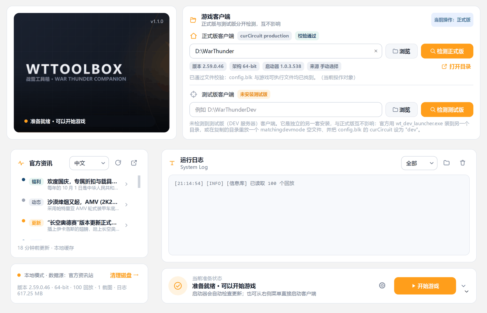
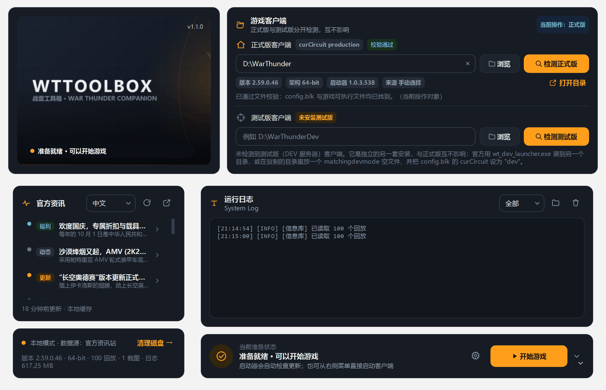
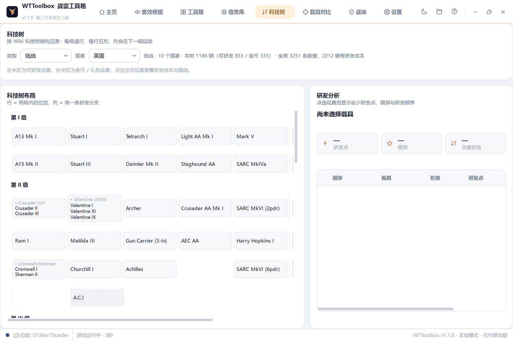
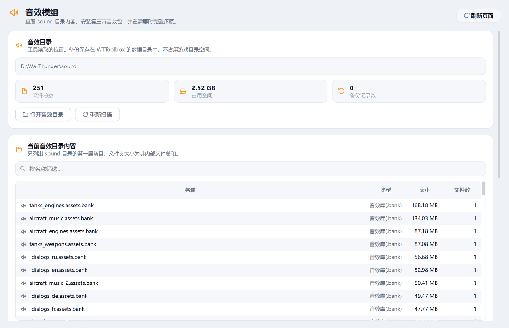
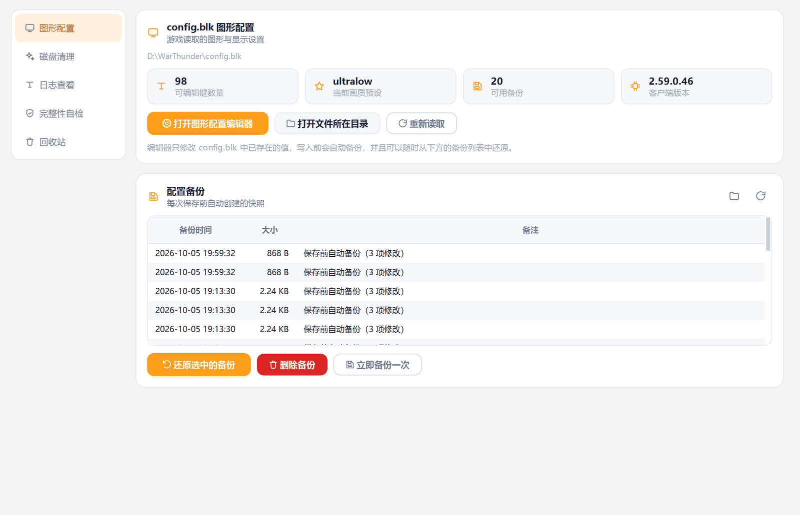
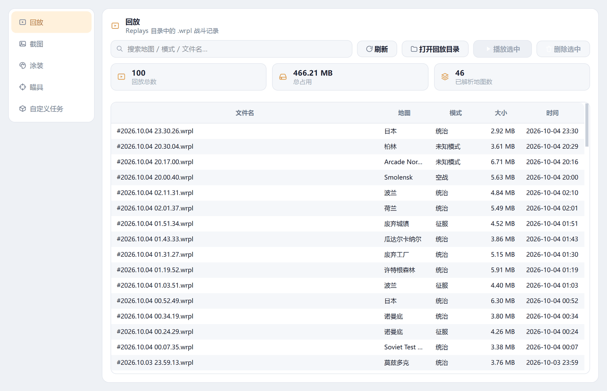
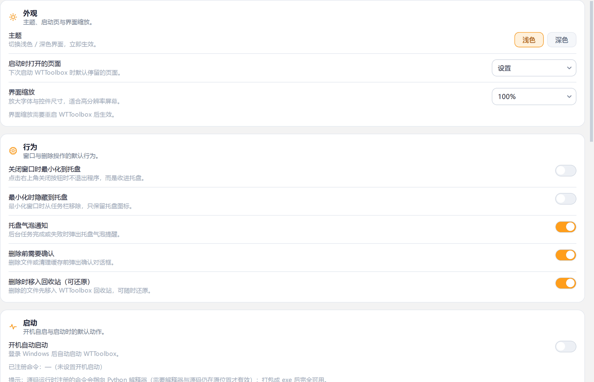

# WTToolbox 战雷工具箱

一个面向 **War Thunder** 的第三方 Windows 桌面辅助工具。界面模仿常见的战雷启动器/盒子布局
（无边框圆角标题栏 + 主页 / 音效模组 / 工具箱 / 信息库 / 科技树 / 载具对比 / 战绩 / 设置），
**每一个功能都真实可用并且已在本机逐项验证**。

> **这不是作弊工具。** 它不注入、不读取、不修改游戏进程内存，不提供任何影响对局的作弊功能。
> 它只读写游戏目录中的普通文件与配置。与 Gaijin Entertainment 无任何关联。

版本 **1.1.0**。本工具原名 ThunderKit，现已更名为 **WTToolbox**：
可执行文件、窗口标题、数据目录、品牌资源全部改名，旧数据目录会在首次启动时
**自动迁移**（见「数据与配置位置」），不会丢设置。

---

## 界面预览

<table>
<tr>
<td width="50%"></td>
<td width="50%"></td>
</tr>
<tr>
<td align="center"><b>主页 · 浅色</b><br>正式版与测试版两个客户端各自检测、互不影响</td>
<td align="center"><b>主页 · 深色</b><br>浅色/深色一键切换，无需重启</td>
</tr>
<tr>
<td colspan="2"></td>
</tr>
<tr>
<td colspan="2" align="center"><b>科技树</b><br>
按 Wiki 原始网格还原各国科技树；点击任意载具算出最少研发点 / 银狮与研发顺序</td>
</tr>
<tr>
<td width="50%"></td>
<td width="50%"></td>
</tr>
<tr>
<td align="center"><b>音效模组</b><br>安装前自动备份，可一键完整回滚</td>
<td align="center"><b>工具箱</b><br>图形配置 / 磁盘清理 / 日志 / 自检 / 回收站</td>
</tr>
<tr>
<td width="50%"></td>
<td width="50%"></td>
</tr>
<tr>
<td align="center"><b>信息库</b><br>回放解析、截图、涂装/瞄具/任务管理</td>
<td align="center"><b>设置</b><br>主题、启动项、缓存、备份、自启</td>
</tr>
</table>

> 截图由 `tools/shot_all.py` 直接渲染真实界面生成（不是手工绘制的效果图）。

---

## 快速开始

### 从源码运行

```powershell
git clone https://github.com/hehehegood6723/WTToolbox.git
cd WTToolbox
python -m venv .venv
.venv\Scripts\pip install -r requirements.txt
.venv\Scripts\python src\main.py
```

需要 **Python 3.12+** 和 **Windows 10/11**。运行时依赖只有 PySide6-Essentials。

### 自己构建 exe

```powershell
.venv\Scripts\pip install -r requirements-dev.txt

# 单文件 exe（产物：.\dist\WTToolbox.exe）
powershell -NoProfile -ExecutionPolicy Bypass -File .\build.ps1

# 更快启动的文件夹版（产物：.\dist\WTToolbox\）
powershell -NoProfile -ExecutionPolicy Bypass -File .\build.ps1 -Onedir
```

`build.ps1` 会依次尝试：项目内的 `.venv` → PATH 上的 `python`。若都不合适，
用环境变量指定（构建中间产物同理）：

```powershell
$env:WTTOOLBOX_PYTHON = 'C:\Python312\python.exe'
$env:WTTOOLBOX_BUILD  = 'D:\build\wttoolbox'
```

找不到带 PySide6/PyInstaller 的解释器时，脚本会**直接报错并给出安装命令**，
而不是构建到一半才失败。

> Windows 默认执行策略会拒绝运行未签名的 `.ps1`，所以上面加了 `-ExecutionPolicy Bypass`
> （只影响这一次调用，不会修改系统设置）。

### 直接下载

发布页提供两个构建好的 exe，无需 Python 环境。两者功能完全相同，区别只在启动方式：

| 产物 | 大小 | 说明 |
| --- | --- | --- |
| `WTToolbox\WTToolbox.exe` | 文件夹 94 MB（exe 本身 2.4 MB） | **推荐**。免解包，双击即开，不受临时目录影响 |
| `WTToolbox.exe` | 单文件 38 MB | 便携单文件；首次启动需解包到 `%TEMP%`，约 4–8 秒 |

> **⚠ 单文件版不要放在 OneDrive / Dropbox 等同步目录里运行。**
> 本机实测（三次复现）：同一个 exe 放在 `D:\...`、`C:\Users\<用户>\<普通目录>\`、
> 甚至 128 字符深度的普通目录下都**启动正常**，唯独放在 OneDrive 同步目录内会弹出
> `Could not create temporary directory!` 并停住。原因是 PyInstaller 单文件版启动时
> 要把自己解包到临时目录，而 OneDrive 的文件系统过滤驱动会干扰这个过程
> （与路径长度、磁盘空间都无关，均已实测排除）。**文件夹版不受影响。**
>
> 单文件版被**强制结束**时解包目录 `%TEMP%_MEIxxxxxx` 会残留；残留多了之后解包可能失败。
> 解决：删除 `%TEMP%_MEI*` 后重启，或直接用文件夹版。这是 PyInstaller 单文件模式的机制，
> 不是本程序的缺陷。

### 命令行参数

| 参数 | 说明 |
| --- | --- |
| `--minimized` | 启动后直接最小化到系统托盘 |
| `--page home\|sound\|tools\|library\|vehicles\|stats\|settings` | 指定启动页 |
| `--game-path <目录>` | 直接指定游戏目录（目录本身决定记到正式版还是测试版） |
| `--detect` | 启动时强制重新搜索游戏目录 |
| `--selftest` | 运行自检、写出诊断报告后退出（见下） |
| `--version` | 打印版本后退出 |

### 自检与诊断

打包后的程序是无控制台的，所以 `--selftest` 会把报告写到
`%APPDATA%\WTToolbox\logs\selftest.txt`：

```powershell
& '.\dist\WTToolbox\WTToolbox.exe' --selftest
Get-Content "$env:APPDATA\WTToolbox\logs\selftest.txt"
```

报告包含：运行形态（打包 / 源码）、`_MEIPASS`、Python 与 Qt 版本、两个资源文件是否存在、
**35 个模块的逐个导入结果**、5 项功能冒烟（blk 解析、图标渲染、设置读写、进程枚举、游戏目录检测），
以及一行结论。排障时先看它。

未捕获的异常会同时写入 `%APPDATA%\WTToolbox\logs\crash.log`（独立文件，不依赖日志模块工作），
并弹出一个可展开详情的对话框，而不是让程序静默消失。

---

## 功能清单（全部真实可用）

### 主页

- **游戏目录自动检测（正式版 / 测试版分开）**：两个客户端各自检测、各自保存，**互不影响**。
  依次尝试
  1. `HKCU\Software\Gaijin\*` 注册表（官方启动器写入，最快最准）
  2. 启动器自己的安装登记表 `%LOCALAPPDATA%\Gaijin\NetAgent\targets\*.blk`
  3. Steam 库元数据（appid `236390`，解析 `libraryfolders.vdf`）
  4. 正在运行的 `aces.exe` / `launcher.exe` 进程镜像路径
  5. 测试版常见的安装目录名（`WarThunderDev` 等）
  6. 有界磁盘扫描（限深度 4、跳过系统目录、90 秒上限，可取消）

  测试版（DEV 服务器）是**独立安装**，判别依据来自官方 Wiki
  （[DEV-server](https://wiki.warthunder.com/mechanics/dev_server)）；满足任意一条即为测试版：

  | 判据 | 说明 |
  | --- | --- |
  | `config.blk` 里 `yunetwork { curCircuit:t="dev" }` | 最直接的证据；正式版这里是 `"production"` |
  | 根目录有空的 `matchingdevmode` 文件 | 官方文档里"手动改测试版"的做法 |
  | 根目录有 `wt_dev_launcher.exe` | 官方测试版启动器的安装产物 |

  没找到测试版时，测试版那一栏会明确显示 **「未安装测试版」** 并说明它是什么、官方怎么装，
  不会拿正式版的路径来充数；把正式版目录填进测试版栏会被拒绝并给出提示，反之亦然
  （拒绝时**原样保留**已有记录，不会被误清空）。

- **当前操作对象**：主页上「正式版 / 测试版」两块各自有一个「设为当前操作对象」按钮，
  音效模组、工具箱、信息库、载具对比等页面只对当前选中的客户端生效；
  底部状态栏会写明当前是哪个版本与哪个目录。
- **启动游戏**：官方启动器（推荐）、直接启动客户端（跳过更新检查）、以管理员身份启动；
  另有「关闭启动器进程」「结束游戏进程」。
- **官方中文资讯**：实时抓取 `warthunder.com/zh/news`，可切换中文/English/Русский，
  带 30 分钟磁盘缓存（断网时自动回落到缓存）。点击任意一条会在默认浏览器打开
  （Qt → `os.startfile` → `rundll32` → `webbrowser` 四级回退；失败时弹窗给出链接并支持复制；
  右键菜单可「打开链接 / 复制链接 / 复制标题」）。
- **运行日志**：WTToolbox 自身的操作记录，彩色分级、可过滤、可清空。
- **本地状态**：游戏版本（读 `win64/aces.exe` 的版本资源）、架构、启动器版本、回放/截图数量、
  日志占用、累计记录时长。

> 主页**没有**「已连接服务器 / 用户 UID」这类状态，因为本工具不连接任何自有服务器，不会伪造这类信息。

### 音效模组

- 列出 `sound\` 目录内容（第一层条目 + 递归大小、文件数）。
- **安装音效模组**：支持 `.zip` 或文件夹，自动识别并剥离压缩包里多套一层的 `sound\` 目录，
  可安装到 `sound\` 根目录或任意子目录。
- **安装前自动备份**：每一个被覆盖的文件都会被复制到 `%APPDATA%\WTToolbox\mods\sound\<时间戳>\`
  并写入清单；新增文件也会被记录。
- **一键完整回滚**：把被覆盖的文件原样还原、把本次新增的文件删除。
  已通过「安装 → 快照对比 → 回滚 → 与安装前逐文件字节对比」的方式验证一致性。
- 设置游戏目录后页面会**自动重挂载**（启动时目录往往晚一步才检测到）。
- 是否真的在游戏里生效取决于模组本身，工具不做这种承诺；它承诺的是文件系统可完整还原。

### 工具箱

| 子功能 | 说明 |
| --- | --- |
| **图形配置** | 完整的 `config.blk` 编辑器，见下节 |
| **磁盘清理** | 分区统计 `compiledShaders`、`.obsolete`、CEF 浏览器缓存、`.game_logs`（按天数）、`.launcher_log`、`.start_app_logs`、`cache\content`、`cache\contentUGC`，以及**默认不勾选**的回放与截图；显示体积/文件数与风险等级，可取消，默认移入回收站 |
| **日志查看** | 读取 `.launcher_log` 与 `.start_app_logs` 的纯文本日志：文件列表、内容查看、按 `[D]/[I]/[W]/[E]` 级别过滤、**实时跟随**（增量读取，正确处理跨读取的多字节字符）。`.clog` 见「已知限制」 |
| **完整性自检** | 检查 15 个必需/可选文件、11 个目录、`config.blk` 可解析性与可写性、残留临时文件、磁盘剩余空间、客户端版本，并给出具体建议 |
| **回收站** | 本工具删除的一切默认先移入 `%APPDATA%\WTToolbox\trash\`，可还原到原位置或指定目录，也可永久删除/清空 |

### 信息库

| 子功能 | 说明 |
| --- | --- |
| **回放** | 解析 `.wrpl` 头部得到地图与模式（中文名 + 模式名），支持搜索、排序、显示体积/时间、用游戏打开、删除 |
| **截图** | 缩略图网格，异步加载，双击打开原图，可删除 |
| **涂装 / 瞄具 / 自定义任务** | 列出内容、显示是否含 `.blk` 配置、从 `.zip` 或文件夹安装（含 zip-slip 防护与自动识别顶层目录）、删除 |

### 载具对比

任选两辆载具，按双方**都有**的指标生成对比雷达图。

- **收录 3,251 辆载具**（官方 `sitemap-units.xml` + Wiki 科技树页面构建）：10 个国家、5 个类别
  （坦克 1,224 / 飞机 1,340 / 直升机 112 / 远洋舰船 330 / 近岸舰艇 245）、第 1–8 级，
  全部带真实显示名。索引随程序打包，不联网也能搜索。
  **索引里的每一条都是真实存在的 Wiki 页面**——科技树上的"文件夹节点"
  （`*_group`，共 398 个）在 Wiki 上没有页面，已经剔除，不会让你选到一个点了没反应的条目。
  科技树已下架但 Wiki 仍有页面的 16 辆车（Leopard I、Panther II、MQ-1、Wing Loong I、
  Aichi E13A1、Walrus Mk.I 等）也一并收录。
- **同类型才能对比**：坦克 ↔ 舰船、飞机 ↔ 坦克 这类跨军种选择会**直接拒绝**并提示
  「不同阵营无法比对：坦克 / 装甲车辆 ↔ 远洋舰船」，不会去下载两份数据再画出一张没有意义的图。
  选完一侧后，另一侧的选择器会**自动锁定到同一类型**（类型下拉框变灰并写明原因）。
- **选择器**：按名称（中/英/代号）搜索 + 国家 / 类型 / 阶级筛选；输入有 140 ms 防抖 +
  批量刷新，连续打字不会卡（实测 5 次击键 9 ms）。
- **雷达图**：每根轴以两车中较强的**真实数值**为 100%，双方各画一个多边形；
  轴旁边直接标出两车的原始数值（例如「正面装甲 45 / 45 / 40 mm  vs  50 / 30 / 20 mm」），
  颜色与图例对应。哪个指标读不到就不画那根轴，**不会用推测值填充**。
  数据获取中、跨军种被拒绝、网络失败这三种状态都会直接显示在图上，不会让人以为"点了没反应"。
- **武器归属严格分开**：Wiki 的 Armaments 区块里，主炮和并列机枪/自卫机枪是**各自的子块**
  （`game-unit_weapon`）。本工具按武器解析，**只有主武器**参与雷达与指标，
  次武器的数据仍完整保留在「完整参数」里并标注武器名。
  否则会出现 T-34 的"射速 600 发/分"——那其实是它 7.62 mm DT 并列机枪的射速。
  主炮的射速按**装填时间**换算（T-34：6.9 s → 8.7 发/分），并同时显示秒数与发/分。
- **指标对照表**：逐项列出原始数值、单位与优势方，并给出「A 占优 N 项 / B 占优 M 项」的计数
  （明确标注每项权重相同，不代表实战强弱）。每根轴都有悬停说明，解释它的含义与来源，
  例如「功重比 = 发动机功率 ÷ 重量（Wiki: Power-to-weight ratio），不是喷气机的推重比」。
- **完整参数**：把两辆车在 Wiki 上的原始条目全文列出（存活性与装甲 / 机动 / 火力 / 经济 /
  飞行性能 / 一般特性 / 武器 等分节，每个武器单独一节），可自行核对。
- 数据来自 `wiki.warthunder.com/unit/<代号>`。结果缓存在 `%APPDATA%\WTToolbox\cache\vehicles\`
  （30 天有效），页面上一键可清空。缓存保存的是**原始解析结果**，指标在读取时重新派生，
  因此调整解析规则不需要重新下载页面。
- **记住上次对比**：对比成功后会把这一对写进设置，下次打开页面自动恢复。

### 科技树

按 **Wiki 科技树的原始网格**渲染 5 个类别 × 各国的完整科技树：每级逐行、每行五列，
列会在下一级延续，和游戏里的排布一致（例：美系一级第一行就是
`M2A4 / M2 / LVT(A)(1) / M13 MGMC / M2A2`）。左半区是可研发载具，右半区是金币 / 礼包载具。
文件夹（如 `M4A1/M4/M4A2`）会展开成每个成员**各自可点**，因为它们是分别研发的。

点击任意载具即可算出**研发这辆车所需的最少研发点与银狮，以及完整的研发顺序**：

- **前置链**：沿科技树的箭头回溯，文件夹会展开成内部顺序（M4 需要 M4A1，M4A2 需要 M4）。
- **阶级门槛**：解锁某一级需要先研发若干辆上一级的载具。数值取自游戏内的解锁提示
  （由项目所有者提供），按类别区分：

  **载具名称**取自**游戏自己的中文本地化**：通过中文社区 Wiki 对本地化数据库的镜像，按游戏代号精确匹配（3,251 辆中命中 3,148 辆，96.8%），不是机器翻译。格子里显示游戏列表用的简称，悬停可以看到完整官方型号与英文名；数据库没收录的 103 辆（多为最新活动载具）如实回退显示英文。

| 类别 | 门槛 |
  | --- | --- |
  | 陆战 | II 级 4 辆、III 级 5 辆、IV–V 级 6 辆、VI 级及以后 5 辆 |
  | 空军 | II 级 3 辆、III–V 级 6 辆、VI–VIII 级 5 辆、IX 级 3 辆 |
  | 海军 | 需研发上一级全部载具，超过 6 辆时只需 6 辆 |
  | 直升机 | **从 V 级起**：解锁需要 **1 辆同国 V 级陆战或空中载具**（不是低阶直升机）；之后每级需要 **1 辆上一级直升机** |

- **最少成本的补车**：门槛不足时按研发点从低到高补齐（**贪心最小值，不保证全局最优**，
  界面会说明）。备用 / 初始载具（Wiki 未公布研发成本）按免费计并单独列出。
- 面板会逐条列出**每一辆**要研发的车、阶级、研发点、银狮和它被计入的原因，所以数字可以
  直接和游戏对照。金币 / 礼包载具会被明确告知"不能用研发点解锁"。

> 研发点与银狮来自 Wiki 各载具页面公布的数值，**不会推测**。银狮按"沿途每辆车都购买"
> 合计；若游戏只要求研发不要求购买，银狮会少于该值。跨阶级的"同一列上下相邻"前置
> Wiki 未显式标注，由列位置推导，界面会标注哪些是推导的。

### 穿深对照

选任一载具的任一发炮弹，指定距离与入射角，对任一目标载具的**每个装甲部位**判定击穿与否。

- **炮弹列表**取自 Wiki 的弹药表，含弹种中文名与所属武器（主炮 / 机枪分开），
  例如 T-34 (1941) 的 `BR-350A（风帽被帽穿甲高爆弹）`、`BR-350SP`、`Sh-354T` 等。
- **穿深**是 Wiki 公布的真实数值：每发弹在 10 / 100 / 500 / 1000 / 1500 / 2000 m 的毫米数，
  换算到所选距离（取最近的一档并如实标注）。
- **装甲**是 Wiki 公布的装甲栏：坦克为车体 / 炮塔 × 正 / 侧 / 后，舰船为船体 / 上层建筑等
  （按页面上的标签原样读取，不硬套坦克的字段）。
- 结果给出逐部位的**厚度 / 等效厚度 / 穿深 / 判定 / 余量**，并同时给出**反向对照**
  （对方的炮弹打你如何），因为这才是实际对局关心的问题。
- 入射角会把厚度换算成几何等效值（厚度 ÷ cos 角），但**明确标注结果偏乐观**：
  游戏还会对斜靶降低穿深并有转正 / 跳弹规则，这些**没有公开公式**，所以不会假装能算。
- 目标没有公布装甲（例如飞机）时会显示"数据不足"，**不会编一个数字**。

> 这是**数据对照，不是游戏的弹道模拟**。本工具不会提取游戏的 3D 模型（那是 Gaijin 的版权
> 资源），也不会声称结果与游戏内的装甲分析完全一致。

### 战绩

**必须先确认免责声明**才能使用；确认动作需要勾选复选框后再点按钮，确认时间会被记录，可随时撤回。

- 填写游戏昵称 → 一键在默认浏览器打开**官方**战绩页（`warthunder.com/zh/community/userinfo/?nick=…`），
  另有社区主页、复制链接。
- **为什么不能在程序里直接显示战绩？** 本工具实测过官方接口：返回 **HTTP 403**，
  正文写着 `Enable JavaScript and cookies to continue`，是站点的反爬保护。
  本工具**不会去绕过它**，也不会凭空生成任何战绩数字，因此这里一个虚构数字都没有。
- **本机游戏记录**（这些是真能统计的）：累计记录时长、启动次数、回放数量与最近一场回放
  （地图 / 模式 / 时间）、截图数量、客户端版本、安装完整性、日志占用。
- 昵称可以手动填写，也可以点「尝试自动识别」在启动器的**纯文本日志**里查找
  （找不到就如实说找不到；注册表里的加密凭据本工具从不读取）。

### 设置

主题（浅色/深色，立即生效）、启动页、界面缩放、托盘行为、删除确认、回收站开关、
**开机自启**（真实写入 `HKCU\...\Run`，并显示已注册的命令）、启动时最小化、启动时自动检测、
资讯语言与缓存时长、日志保留天数、备份保留数量、清空资讯缓存、回收站统计与清空、
重置全部设置，以及「关于」中的环境信息、诊断信息复制与免责声明。

---

## 窗口外观

窗口是无边框的，四角**圆角 + 柔和投影**，最大化时自动变成直角。

实现方式：Windows 不会给 `WS_POPUP` 型的无边框窗口做 DWM 圆角
（本机实测：`DwmSetWindowAttribute(CORNER_PREFERENCE)` 返回成功、读回值也正确，
但窗口样式里既没有 `WS_CAPTION` 也没有 `WS_THICKFRAME`，DWM 实际不画），
所以窗口设为半透明（`WA_TranslucentBackground`），由 `MainWindow.paintEvent`
自绘圆角主体与阴影，标题栏/状态栏用 QSS 的 `border-*-radius` 对齐圆角，
最大化时给两者打上 `tkFlat` 属性切成直角。缩放热区被放在不透明的主体边缘上——
透明区域在分层窗口里是点击穿透的，放在那里会抓不住。

---

## 图形配置编辑器（`config.blk`）

这是投入最多的一块，也是风险最高的一块，所以设计上非常保守：

- **字节级无损**：底层 `BlkDocument` 只替换发生变化的**值字面量**，其余字节（注释、顺序、
  工具不认识的键、缩进风格）原样保留。已用本机真实的 `config.blk` 验证 `rerender()` 与原文**逐字节一致**。
- **原子写入**：先写临时文件并 `fsync`，再 `os.replace` 覆盖，中途断电不会写出半个文件。
- **暂存式编辑**：改动先在内存里暂存，底部实时显示「已修改 N 项」，点「保存并备份」才落盘。
- **保存前自动备份**到 `%APPDATA%\WTToolbox\backups\config\`，并可随时从该列表还原
  （还原前又会自动备份一次当前文件，因此还原本身也可逆）。
- **中文标签与说明**：为 `config.blk` 中约 90 个键提供了中文名称、解释、建议取值范围；
  未收录的键会归入「其它参数」，用类型匹配的控件呈现，不会被隐藏。
- **画质预设**只修改 `graphicsQuality` 这一个键，其余交给游戏自己派生——避免凭空猜测枚举值。
  字符串类控件一律**可编辑**，可以自己输入原始值。
- 危险键（如 `use_eac`）会带 ⚠ 标记与警告说明。
- 游戏正在运行时，页面顶部会显示醒目警告；保存时也会再次确认。

---

## 数据与配置位置

| 内容 | 路径 |
| --- | --- |
| 设置 | `%APPDATA%\WTToolbox\settings.json` |
| 正式版目录 | `settings.json` → `game_path` / `known_paths` |
| 测试版目录 | `settings.json` → `game_path_dev` / `known_paths_dev`（与正式版互不覆盖） |
| 运行日志 | `%APPDATA%\WTToolbox\logs\wttoolbox.log`（滚动，2 MB × 3） |
| 资讯缓存 | `%APPDATA%\WTToolbox\cache\news_<语言>.json` |
| 载具详情缓存 | `%APPDATA%\WTToolbox\cache\vehicles\<代号>.json` |
| 配置备份 | `%APPDATA%\WTToolbox\backups\config\` |
| 音效模组回滚集 | `%APPDATA%\WTToolbox\mods\sound\<时间戳>\` |
| 回收站 | `%APPDATA%\WTToolbox\trash\<时间戳>\` |

**改名迁移**：旧版本（ThunderKit）的数据目录是 `%APPDATA%\ThunderKit`。
新版本首次启动时会自动把它迁移到 `%APPDATA%\WTToolbox`：
- 如果新目录还不存在 → 直接**改名**（同盘瞬时完成，旧名字随之消失，数据完整搬过来）；
- 如果新目录已存在（例如上次迁移只做了一半）→ **逐文件补齐，绝不覆盖**新版本已写的文件，
  旧目录保留不删，留作退路。

迁移是幂等的，并以新目录里是否存在 `settings.json` 作为「已完成」标志：
一旦迁移完成，之后启动不会再动旧目录，不会把旧数据盖回去。

本工具**不会**向注册表写入除 `HKCU\...\Run\WTToolbox`（开机自启，可在设置中关闭）以外的任何内容，
也不会在游戏目录里留下除你自己安装的内容以外的文件。

---

## 已知限制（都是刻意不做的，不是没做完）

1. **`.game_logs\*.clog` 无法解码。** 它使用 Gaijin 私有压缩格式（固定 16 字节文件头，
   已验证既不是 zlib / raw-deflate / gzip，文件内也没有可读 ASCII 段）。
   工具因此只对它提供文件清单、占用统计与清理，不会假装能显示内容。
2. **回放没有战果数据。** `.wrpl` 文件尾部没有可解析的结果 JSON（已验证），
   所以只能给出地图与模式，不会伪造击杀数或胜负。
3. **回放播放依赖游戏客户端。** 本机 `.wrpl` 没有注册 shell 关联，
   工具通过 `aces.exe "<回放文件>"` 请求游戏打开。若你的版本忽略该参数，
   请改用游戏内的回放浏览器——**这一项需要在游戏内实测确认**。
4. **完整性自检不校验文件内容。** 那需要 Gaijin 的官方清单，工具只能确认文件存在、
   非空、配置可解析。
5. **不是作弊工具、也没有云端账号体系。** 没有服务器、没有 UID、没有排行榜、
   没有自动更新检查。资讯来自官方公开网页。
6. 界面缩放的改动需要重启生效。
7. 单文件版依赖 PyInstaller 的临时解包目录，被强制结束后可能残留 `%TEMP%_MEI*`
   并导致下次启动失败（详见上文）。文件夹版没有这个问题。
8. **账号在线战绩无法在程序内自动读取。** 官方接口对自动请求返回 403 反爬页
   （实测正文为 `Enable JavaScript and cookies to continue`），本工具不做绕过，
   只提供「打开官方页面」与「本机可统计的数据」。详见上面的「战绩」一节。
9. **载具数据依赖 Wiki 页面结构。** 若官方 Wiki 改版，解析会失效——此时页面会**明确报错**
   而不是显示错误数字（缓存中的旧数据仍可正常使用）。
   个别指标在页面上有多个变体（如最大速度分「完全体/白板 × AB/RB」四列），
   本工具取**完全体 · RB** 那一列；装填时间取**完全体（aces）**值。
10. **Wiki 偶尔会很慢。** 实测 12 个随机页面里有 1 个超过 20 秒没响应。
    工具因此把网络超时设为 15 秒并自动重试一次；仍失败时会在雷达图区域显示原因，
    点「开始对比」可以重试。

---

## 验证记录

所有功能都在本机（Windows 11 22631、War Thunder 2.59.0.4x、`D:\WarThunder`）逐项实测过。

**自动化测试（共 587 项断言，全部通过）**

测试套件**在装没装游戏的机器上都能跑**：找到游戏时下面的集成检查真跑；
找不到时这些检查会标记为 `[skip]` 并说明原因，其余照常运行。
指定游戏目录用 `WTTOOLBOX_GAME=D:\WarThunder`；
想看"没装游戏"的路径，把它指向一个不存在的目录即可。

| 套件 | 有游戏 | 无游戏 | 覆盖内容 |
| --- | --- | --- | --- |
| `tests/test_syntax.py` | 6 | 6 | 仓库卫生：**所有 Python 文件字节编译**（用 `compile()` 而不是只做 `ast.parse`——后者查不出「`return` 跑到函数外」这类语义错误，曾经真的让一个坏文件进了提交）、`core/` 必须保持无 Qt 依赖、源码里不得出现开发机的绝对路径 |
| `tests/test_blk.py` | 53 | 25 | 真实 `config.blk` 的**逐字节无损往返**、值替换、新建键、新建嵌套块、原子写入与备份；无游戏时改用随仓库提供的合成夹具 |
| `tests/test_core.py` | 110 | 69 | 路径检测、`aces.exe` 版本读取、101 个回放头部解析、日志枚举与增量跟随、清理项测量、`zip` 安装（含 zip-slip 防护）、**音效模组安装→回滚后与安装前逐文件字节一致**、实时官方资讯抓取 |
| `tests/test_ui.py` | 44 | 44 | 主窗口装配、8 个页面的**按需加载**与切换、8 个缩放热区、托盘、以及**配置编辑器在沙箱副本上的真实写入**（改值 / 套预设 / 新建键 / 参数不丢失 / 注释不丢失 / 无临时文件残留）；无游戏时用合成的合法安装目录 |
| `tests/test_features.py` | 149 | 149 | **武器归属**（合成页面上验证坦克的机枪射速不会变成坦克射速、主炮装填换算、炮塔转速取到父级标签、缓存重载后指标重新派生）、**功重比命名与易混淆指标的悬停说明**、**图标按 devicePixelRatio 渲染到物理像素且不被裁切**、载具索引与筛选、真实 Wiki 页面的指标解析与比较、**雷达图比例与胜负判定的一致性**、**音效页在设置游戏目录后自动重挂载**、**主题切换耗时 < 2 秒**、**通过真实按钮来回切主题**、**圆角窗口的四角透明/主体不透明/最大化变直角/热区落在主体上**、载具对比页交互、战绩页的免责声明门与撤回、资讯点击链路 |
| `tests/test_channels.py` | 68 | 67 | **正式版 / 测试版的三种判别依据**（`curCircuit`、`matchingdevmode`、`wt_dev_launcher.exe`）、**两个通道的结果集互斥**、本机真实检测（正式版找到、测试版如实为空）、**两个通道的路径设置互不覆盖**、**把某一版目录填进另一版会被拒绝且不破坏原有记录**、主页两块 UI 的状态与互相重归档、状态栏跟随当前客户端、切换客户端后页面重建且栈不重复 |
| `tests/test_techtree.py` | 92 | 92 | **科技树完整性**（五类十国、3,172 辆、393 个文件夹、九级空军、无重复 slug）、**美系一级网格与游戏逐格一致**、**前置链穿过文件夹且不泄漏 `*_group`**、**列连接推导**、**按类别区分的阶级门槛**（陆战 4/5/6/6/5、空军 3/6/6/6/5/5/5/3、海军上限 6）、**研发计划的自洽性**（合计等于分项之和、按阶级排序、金币车明确告知不可研发）、**直升机入门规则**（V 级由同国五级陆战/空中载具解锁、后续每级 1 辆上一级直升机、入门成本单独列出且可从合计中减去）、**中文名**（名称表覆盖率、优先显示中文、英文与完整型号仍可取到、无中文条目时回退英文、研发步骤也是中文）、**穿深只使用公布数据**（BR-350A 在 10 m 为 87 mm、最近档位换算、斜角等效厚度与偏乐观提示、无装甲数据时报告未知）、**两个页面可构建并响应点击** |
| `tests/test_vehicle_index.py` | 65 | 65 | **索引零死链**（无 `*_group` 文件夹节点、无重复、每条都有名称/类型/国家、类型与国家都是已知值）、**16 辆补录载具逐个核对**、**大小写不敏感的 slug 查找**、随机抽样实网验证、**跨军种对比被拒绝并给出明确文案**、**飞机/舰船/艇/坦克四类同型对比都能出图**、**选择器的类型锁定**与**连续打字不卡顿** |

需要游戏目录才能跑的分支，全部集中在 `HAVE_GAME` 判断后面（见 `tests/_game.py`），
所以贡献者不会因为机器上没装战雷而看到一片红色。

> `test_channels.py` 的测试版分支使用**按官方文档构造的合成目录**——本机没有安装真实的
> 测试版客户端，这一点在报告里如实标注，不会假装测过真机测试版。

**CI**：`.github/workflows/tests.yml`。确定性的三个套件（blk / ui / channels）是**必须通过**的；
另外三个会访问 `wiki.warthunder.com` 与 `warthunder.com`，被限流或被墙时只能说明网络问题，
所以单独作为非阻塞任务，不拿它拦 PR。

**打包后实测**

- `--selftest`：**35 个模块**导入全部 OK、2 个资源文件 OK、5 项功能冒烟 OK → `结论: 全部通过`
  （两个版本都实测，退出码均为 0）
- 冻结版启动截图（用 `PrintWindow` 抓窗口自身像素，不抢焦点、不受遮挡影响；
  半透明分层窗口同样能正常抓到）：标题栏 `WTToolbox 战雷工具箱`、banner `WTTOOLBOX`、
  日志 `[启动] WTToolbox v1.1.0 启动`、状态栏 `WTToolbox v1.1.0`，
  自动经注册表识别到 `D:\WarThunder`，并如实记录「启动时未检测到测试版客户端（未安装测试版）」
- **端到端验证载具对比**：预置设置 → 启动冻结版 `--page vehicles` →
  程序自行拉取 Wiki 数据并画出雷达图（飞机对 Bf 109 F-4 vs P-51C-10 六根轴；
  坦克对 T-34 (1941) vs Pz.IV F2：正面装甲 45/45/40 vs 50/30/20 mm、功重比 17.7 vs 13.2、
  主炮装填 6.9 s（8.7 发/分）vs 5 s（12.0 发/分）、炮塔转速 17.5 vs 11.2 °/s），退出码 0
- **端到端验证跨军种拦截**：冻结版打开坦克 vs 舰船，图上显示
  「不同阵营无法比对：坦克 / 装甲车辆 ↔ 远洋舰船」，两侧卡片标注「类型不同，无法与另一侧对比」
- **端到端验证改名迁移**：旧 `%APPDATA%\ThunderKit` 的 29 项设置、昵称与对比记录
  被完整迁移到 `%APPDATA%\WTToolbox`，旧目录保留
- 主题切换实测耗时：**0.27–0.8 秒**（1.0.0 为 5–7 秒）
- 全程未修改 `D:\WarThunder\config.blk`（本机实测其变更均来自游戏自身运行），
  未向 `sound` 目录写入任何内容

**最终产物校验**

| 产物 | 大小 | SHA-256 |
| --- | --- | --- |
| `D:\WTToolbox\WTToolbox\WTToolbox.exe` | 2,422,436 B | `7E42C07F55056EEAD2B240E94A26B9E63EC9153402C542094D3D1785FFF712B1` |
| `D:\WTToolbox\WTToolbox.exe` | 38,884,882 B | `6D1D65A867E1FE576912FF4811E3163DAD098BBD30EE14B76FC9895C8A8CEBEE` |

（哈希对应各产物自身的 exe；`dist\` 下是同一批文件的副本。）

**开发期用真实运行暴露并修掉的问题**

1.0.0：

1. `Blk` 解析器读取带引号的字符串时切片为空，导致所有 `t` 类型值为空
2. `QObject` 带 parent 时无法 `moveToThread`，后台任务实际跑在 GUI 线程
3. 进度回调是普通 Python 函数，PySide6 在工作线程里直接调用它 → 跨线程操作控件
4. `__import__(变量)` 导致 PyInstaller 漏打包页面（打包后页面全空）
5. `Copy-Item -Recurse` 到已存在目录会嵌套复制，始终发布旧 exe
6. 两种构建模式共用 work 目录，`-NoClean` 复用陈旧分析结果
7. `%APPDATA%\...\backups\config` 创建失败时抛未捕获异常（每次启动必现）
8. 启动时资讯被并发抓取 4 次
9. 旧的 Toast 被销毁后 `notify()` 调用 `isVisible()` 抛 `RuntimeError`

1.1.0（用户反馈，全部定位到根因后修复）：

10. **音效页设置游戏目录后仍不可用**：`SoundPage` 根本没有 `on_install_changed` 钩子，
    页面在启动时按「无游戏目录」建好后**永远不会重挂载**。
11. **切换深浅色卡死**：`_rebuild()` 只删掉了布局里的控件、没有删除 `QVBoxLayout` 本身，
    于是新建的布局无法安装到窗口（Qt 报 `already has a layout`）；
    另外 `deleteLater()` 不会立即销毁控件，`setStyleSheet` 仍要重新 polish 全部 1042 个控件
    （实测 **2.9 秒**；真正销毁后只剩 35 个控件，**0.03 秒**）。
    修法：只重建页面、保留窗口外壳，拆完页面后显式冲刷 `DeferredDelete`，页面改为按需创建。
12. **图标模糊**：新增 devicePixelRatio 渲染时把 `setDevicePixelRatio()` 写在了绘制**之前**，
    `QPainter` 坐标系因此被缩放，只画出了 SVG 左上四分之一。
13. **资讯点击不跳转**：点击链路本身是通的，问题在于只有 `os.startfile` 一条路径且失败时只弹一句提示。
14. 页面被销毁后，仍在飞行的后台任务回调会访问已删除的 C++ 对象。
15. **单文件版在 OneDrive 目录内无法启动**（`Could not create temporary directory!`）。
16. **深浅色只能切到深色、切不回浅色。** `AppContext.set_theme()` 的早退判断用的是
    `self.palette`，而这个值只在 `__init__` 里赋过一次、之后从不更新。
    **这个 bug 之所以漏过第一轮测试，是因为测试直接调用了 `_on_theme_changed(name)`，
    绕开了真实按钮路径**——现在测试改为 `QTest.mouseClick` 点真实按钮。
17. **页面销毁后延迟回调仍会触发**（`QTimer.singleShot(200, lambda: self._load_news())`）。
    修法：新增 `widgets.later(owner, ms, cb)`，把定时器挂到控件名下。
18. **`Copy-Item -Recurse` 再次把目录套了一层**，导致 exe 还是旧的、
    启动报 `Failed to start embedded python interpreter!`。部署改用 `robocopy /MIR`。
19. **版本不符时"拒绝写入"把已有的记录清空了**（拒绝应当原样不动地返回）。
20. **切换"当前操作对象"后页面栈里堆了 14 个控件**（`_build_pages()` 不是幂等的）。
21. **窗口在最小尺寸下把导航压成"音…"、把客户端卡片压到裁切。**
    修法：标题栏宽度不足 1140 px 时自动改用短标签；用二分法实测出
    **不裁切所需的最小窗口高度是 796 px**（屏幕可用高度 840 px），据此把 `MIN_HEIGHT` 定为 780。
22. **坦克的"射速"被写成了并列机枪的射速。** 用户直接问到："为什么坦克射速有 600 发/分，
    这是机关炮吗"。查证后确认：Wiki 的 Armaments 区块里主炮和机枪是**各自的
    `game-unit_weapon` 子块**，而原来的解析把两个武器拍平成一个命名空间。
    修法：按武器分块解析，**只有主武器**进入指标与雷达；主炮射速改由装填时间换算；
    所有武器来源的数字都带上武器名。顺带修好了同一原因导致的炮塔转速取不到父节点的问题。
23. **"推重比"应为"功重比"。** 用户指出：坦克那个 hp/t 的指标是功重比，
    推重比是推力/重量、属于喷气机。查证确认 Wiki 字段名就是 `Power-to-weight ratio`，
    而且飞机页根本没有推重比字段。修法：改名为「功重比」，并给易混淆的指标补上悬停说明。
24. **选空军或海军之后"点对比没反应"。** 索引里有 **398 个 `*_group` 文件夹节点**
    （坦克 170、飞机 217、舰船 9、艇 1、直升机 1），它们是科技树上的折叠节点链接，
    **在 Wiki 上全部 404**，官方 sitemap 里一个都没有——空军里 14% 的条目都是这种死链。
    修法：索引改为以官方 `sitemap-units.xml` 为准，文件夹节点全部剔除。
25. **跨军种对比没有拦截。** 坦克 vs 舰船原先会"成功"画出一张没有意义的图。
    修法：类型不同直接拒绝并给出明确文案；选择器自动锁定同类型。
26. **数据获取期间看不出进度。** 修法：把获取中 / 被拒绝 / 失败三种状态直接画在雷达图区域；
    网络请求改为 15 秒超时 + 自动重试一次；选择器搜索加 140 ms 防抖 + 批量刷新。
27. **改名时构建目录被误改。** 批量改名脚本的保护占位符恢复得太早，
    把 `D:\ThunderKit-build`（venv 所在处，不能移动）也改掉了。修法：全部改回并核对。
28. **数据目录迁移守卫过于脆弱。** 首次迁移尝试因 `WinError 183`（目标已存在）失败后，
    「新目录存在就跳过」的守卫让迁移**永久失效**，用户设置会丢。
    修法：改成幂等的逐文件补齐（绝不覆盖新文件），并以 `settings.json` 是否存在作为完成标志。

---

## 项目结构

```
thunderkit/                         ← 工作区目录名，工具本身叫 WTToolbox
├─ src/
│  ├─ main.py                       入口：单实例、流重定向、异常兜底、启动流程
│  └─ wttoolbox/                    Python 包
│     ├─ __init__.py                APP_NAME = "WTToolbox"
│     ├─ assets/
│     │  ├─ icon.ico banner.png icon_256.png
│     │  ├─ vehicles.json           3,251 辆载具索引（名称/国家/阶级/类型）
│     │  ├─ tech_trees.json         科技树网格（5 类 × 各国 × 阶级 × 行列）
│     │  ├─ vehicle_names_zh.json   载具中文名（按游戏代号匹配的本地化文本）
│     │  └─ vehicle_data.json       每辆车的研发点/银狮/装甲/弹药穿深表
│     ├─ core/                      纯 Python 后端（不导入 Qt，可命令行测试）
│     │  ├─ blk.py                  .blk 解析/保真写回（字节级无损）
│     │  ├─ blk_schema.py           config.blk 键位中文元数据
│     │  ├─ config_backup.py        配置快照
│     │  ├─ gamepath.py             游戏目录检测与校验（含正式版/测试版通道判别）
│     │  ├─ gamelaunch.py           启动器/客户端/回放启动，进程管理
│     │  ├─ gamelog.py              日志枚举、增量跟随、.clog 说明
│     │  ├─ replays.py              .wrpl 头解析与管理
│     │  ├─ mapnames.py             地图代号 → 中/英显示名
│     │  ├─ library.py              涂装/瞄具/任务/截图 + 安全解压
│     │  ├─ soundmods.py            音效模组安装与完整回滚
│     │  ├─ cleaner.py              磁盘占用统计与清理
│     │  ├─ healthcheck.py          完整性自检
│     │  ├─ news.py                 官方资讯抓取与缓存
│     │  ├─ trash.py                可还原回收站
│     │  ├─ wtdata.py               载具索引 + Wiki 页面解析 + 对比模型
│     │  ├─ techtree.py             科技树网格、前置解析、研发路线与成本
│     │  ├─ penetration.py          弹药穿深 × 装甲厚度的对照判定
│     │  ├─ winutil.py              ctypes/winreg 封装
│     │  ├─ settings.py             设置持久化（两个通道的路径分开存）
│     │  ├─ applog.py               应用日志
│     │  └─ appdirs.py              路径、打包资源定位、旧目录迁移
│     └─ ui/                        PySide6 界面
│        ├─ theme.py  icons.py  widgets.py  context.py
│        ├─ titlebar.py  mainwindow.py
│        ├─ pages/   home.py sound.py tools.py library.py
│        │            vehicles.py stats.py settings.py
│        └─ dialogs/ config_editor.py  vehicle_picker.py
├─ tests/                           test_blk / test_core / test_ui
│  │                                test_features / test_channels / test_vehicle_index
│  ├─ _game.py                      游戏目录探测（决定集成检查跑还是跳过）
│  └─ fixtures/sample_config.blk    合成 config.blk，无游戏时供配置编辑器测试使用
├─ tools/                           make_assets.py  build_vehicle_index.py
│                                   build_tech_trees.py  build_vehicle_data.py
│                                   build_names_zh.py
│                                   crawl_vehicle_data.py
│                                   icon_sheet.py  render_page.py  shot_all.py
├─ .github/workflows/tests.yml      CI
├─ build.ps1                        PyInstaller 构建脚本
├─ requirements.txt                 运行时依赖（PySide6-Essentials）
├─ requirements-dev.txt             构建/资源依赖（PyInstaller、Pillow）
├─ build/version_info.txt           exe 版本资源
├─ LICENSE                          MIT
├─ NOTICE.md                        非官方声明、商标与数据来源说明
└─ CONTRIBUTING.md                  开发约定与"不许造假数据"等硬性规则
```

## 测试

```powershell
.venv\Scripts\python .\tests\test_syntax.py          # 仓库卫生（字节编译 / core 无 Qt / 无本机路径）
.venv\Scripts\python .\tests\test_blk.py             # blk 解析与保真写回
.venv\Scripts\python .\tests\test_core.py            # 全部后端功能（含真实回放/日志/资讯/音效回滚）
.venv\Scripts\python .\tests\test_ui.py              # 主窗口、页面切换、配置编辑器写入
.venv\Scripts\python .\tests\test_features.py        # 图标 DPI、武器归属、载具对比、战绩门禁、主题切换
.venv\Scripts\python .\tests\test_channels.py        # 正式版/测试版两条通道
.venv\Scripts\python .\tests\test_vehicle_index.py   # 载具索引完整性、跨军种拦截、选择器
.venv\Scripts\python .\tests\test_techtree.py        # 科技树、研发路线与成本、穿深对照

# 或者一次跑完
Get-ChildItem tests\test_*.py | ForEach-Object { .venv\Scripts\python $_.FullName }
```

`tests/test_core.py` 的破坏性操作**只在系统临时目录下的沙箱中**进行，不会碰你的游戏文件。

想指定游戏目录：`$env:WTTOOLBOX_GAME = 'D:\WarThunder'`。
把它设成一个不存在的路径，就能看到"没装游戏"时的跳过行为。

载具索引可以重新生成（需要能访问 `wiki.warthunder.com`）：

```powershell
.venv\Scripts\python .\tools\build_vehicle_index.py
```

品牌资源（图标与 banner）可以重新生成：

```powershell
.venv\Scripts\python .\tools\make_assets.py
```

界面可用 `tools/render_page.py <页面> <输出.png>` 单独离屏渲染，用于视觉回归：
`tools/shot_all.py` 会一次性渲染全部 7 个页面的浅色与深色版本。

---

## 贡献

见 [CONTRIBUTING.md](CONTRIBUTING.md)。核心是四条硬性规则：不做作弊功能、
**绝不编造数据**（读不到就说读不到）、破坏性操作必须可还原、如实记录没做到的部分。

## 许可与法律声明

- 代码以 **MIT** 协议开源，见 [LICENSE](LICENSE)。
- WTToolbox 是**非官方**第三方工具，与 Gaijin Entertainment **无任何关联**，
  未获其授权、认可或赞助。"War Thunder" 等名称与商标归 Gaijin 所有，
  此处仅用于说明兼容对象。
- 仓库**不包含任何游戏素材**；图标与 banner 由 `tools/make_assets.py` 程序化绘制，
  不是 Gaijin 的美术资源。
- 载具索引（`vehicles.json`）只包含从公开 Wiki 读取的**事实性标识**（代号、名称、
  国家、等级、类型），不含 Wiki 正文、图片或表格；运行时取到的每个数值都会标注来源链接。
- 依赖许可（PySide6 为 LGPL-3.0，PyInstaller 为带例外的 GPL-2.0）与上述声明的完整版本见
  [NOTICE.md](NOTICE.md)。

## 致谢

- 车辆数据、地图与模式名称来自 [War Thunder Wiki](https://wiki.warthunder.com/)（社区维护）。
- 官方新闻与公告来自 [warthunder.com](https://warthunder.com/)。
- 界面基于 [Qt for Python (PySide6)](https://doc.qt.io/qtforpython/)，
  打包使用 [PyInstaller](https://pyinstaller.org/)，品牌资源绘制使用 [Pillow](https://python-pillow.org/)。
